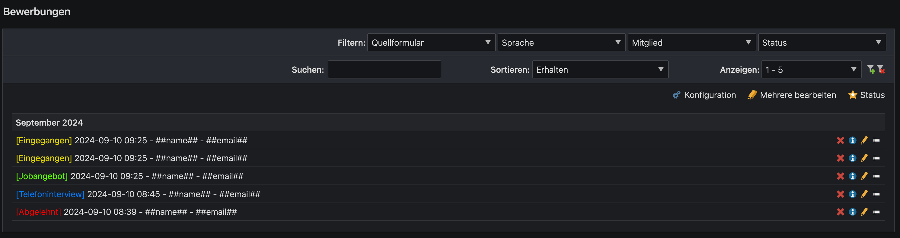

# plenta/contao-leads-status-bundle

`plenta/contao-leads-status-bundle` is an extension for the [Contao CMS][Contao].

This extension adds a status to leads. This gives you a better overview. 🚀  

## Installation

### Install using Contao Manager

Search for **plenta/contao-leads-status-bundle**, **leads** or **status** and you will find this extension.

### Install using Composer

```bash
composer require plenta/contao-leads-status-bundle
```

### Backend


